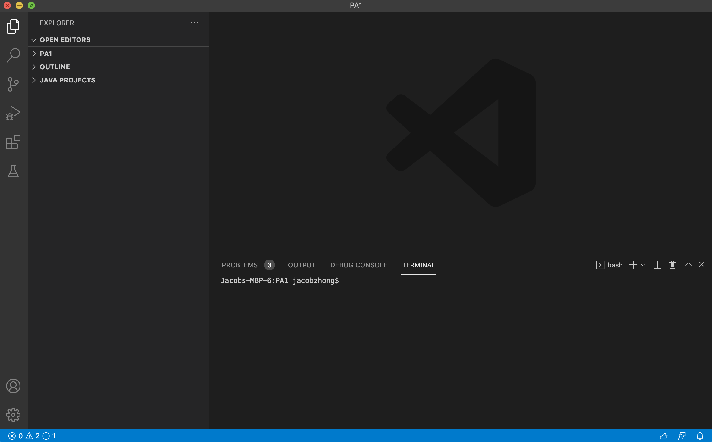

# Remote Access Tutorial

**1. Installing VSCode**
- Go to the website [https://code.visualstudio.com/](https://code.visualstudio.com/) 
- Download for either Windows or Mac (or for any OS you are using)
- After installing, launch the application and it should look like this: 

**2. Remotely Connecting**
- If you're on a Windows computer, download [OpenSSH](https://docs.microsoft.com/en-us/windows-server/administration/openssh/openssh_install_firstuse)
- Afterwards, search up your course specific account for CSE15L at: [https://sdacs.ucsd.edu/~icc/index.php](https://sdacs.ucsd.edu/~icc/index.php) which comes out to cse15Lwi22ahs@ieng6.ucsd.edu for me.
- Next, we can start connecting to a remote host on VSCode by first opening a terminal (Terminal --> new terminal menu option)
