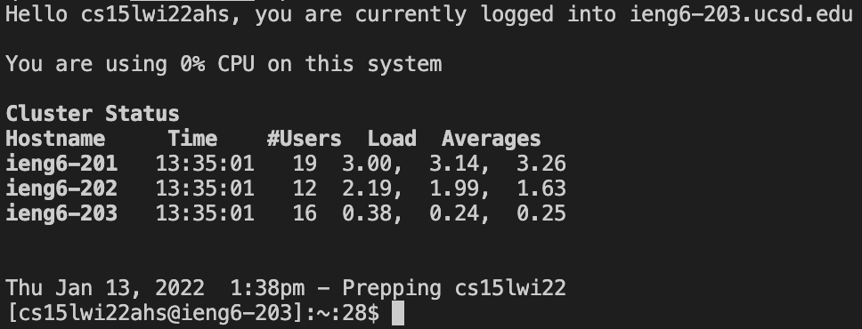
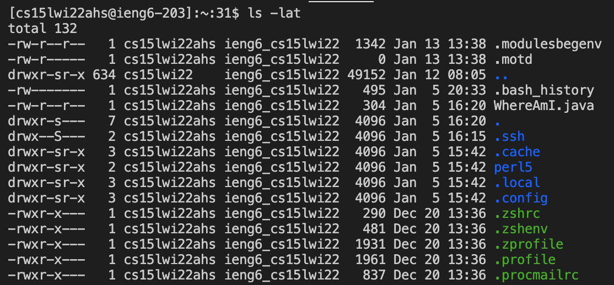
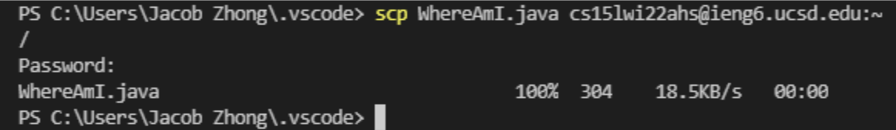

# Remote Access Tutorial

**1. Installing VSCode**
- Go to the website [https://code.visualstudio.com/](https://code.visualstudio.com/) 
- Download for either Windows or Mac (or for any OS you are using)
- After installing, launch the application and it should look like this: 


**2. Remotely Connecting**
- If you're on a Windows computer, download [OpenSSH](https://docs.microsoft.com/en-us/windows-server/administration/openssh/openssh_install_firstuse)
- Afterwards, search up your course specific account for CSE15L at: [https://sdacs.ucsd.edu/~icc/index.php](https://sdacs.ucsd.edu/~icc/index.php) which comes out to cse15lwi22ahs@ieng6.ucsd.edu for me.
- Next, we can start connecting to a remote host on VSCode by first opening a terminal (Terminal --> new terminal menu option)
- In this terminal, type the command ssh + course specific account. Looks like this: `ssh cs15lwi22ahs@ieng6.ucsd.edu`
- If it's the first time that you're accessing the server, the message below will appear. Type `yes` to this. 
```
The authenticity of host 'ieng6.ucsd.edu (128.54.70.227)' can't be established.
RSA key fingerprint is SHA256:ksruYwhnYH+sySHnHAtLUHngrPEyZTDl/1x99wUQcec.
Are you sure you want to continue connecting (yes/no/[fingerprint])?
```
- It will ask for your password after to which insert it to login and it should look like this:


*now our terminal is connected to a computer in the CSE basement at UCSD and any commands ran here will be ran on the CSE computer*

**3. Trying Some Commands**
- some useful commands to use: 
- **cd**: changes the working directory
- **cd** **~**: goes to home directory
- **ls -lat**:lists all files in the working directory
- **ls -a**: lists all hidden directories
- **ls**: lists all directories in current directory
- **pwd**: shows the full pathway of current working directory
- **mkdir**: creates a new directory
- **cat**: concatenates
- To log out of the remote server: ctrl+D or type the command `exit`

Example: 
*the ls -lat command*

**4. Moving Files with `scp`**
- the command `scp` moves/copies files from your computer to a remote computer
- Create a .java file on your computer
- type the commands javac + the .java file and java + the java file. (If you don't have Java installed, this step can be skipped)
- In the terminal of the directory in which the file was created, type the command `scp (created file).java cs15lwi22ahs@ieng6.ucsd.edu:~/`
- There will be a password prompt just like the one when using `ssh`
- After inputing password, login using ssh again and use the command `ls`. 
- This new file should be seen in the home directory now and the commands `javac` and `java` can be run on the remote computer (ieng6 computer)


**5. Setting an SSH Key**
